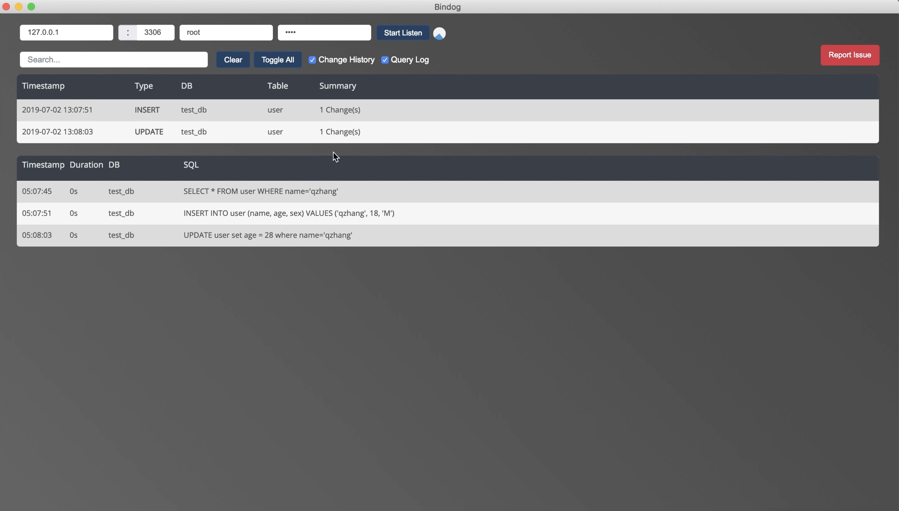

# Bindog

**Real-time MySQL binlog monitoring, powered by Electron**

Bindog helps developers **see database changes as they happen**, making it easy to **catch unintended modifications** during code refactoring or rewriting.



[Watch Live Demo](https://youtu.be/D9C-eu26A9w)

-----

## Key Features

  - **Real-time Monitoring** – Track MySQL binlog events live.
  - **Visual Interface** – Electron-based GUI for instant insights.
  - **Smart Search** – Filter events by database, table, or keyword.
  - **Error Detection** – Quickly spot unexpected database changes during development.

-----

## Requirements

  - MySQL with **binary logging enabled** (`binlog_format = row`)
  - Node.js ≥ 12
  - Electron ≥ 21

-----

## Quick Start

```bash
git clone https://github.com/zhangqibupt/bindog.git
cd bindog
yarn install
yarn start
```

Or download the latest release.

### MySQL Setup

Enable binlog in my.cnf:

```ini
[mysqld]
server-id = 1
binlog_format = row
log_bin = /var/log/mysql/mysql-bin.log
```

⚠️ Tables ignored by binlog-ignore-db won’t trigger events.

## Why Bindog?

  - Validate code changes against database impact instantly.
  - Speed up debugging by highlighting unexpected modifications.
  - Interactive GUI makes binlog exploration intuitive.

## Limitations

  - MySQL only.
  - Requires Node.js ≥ 12, Electron ≥ 21.
